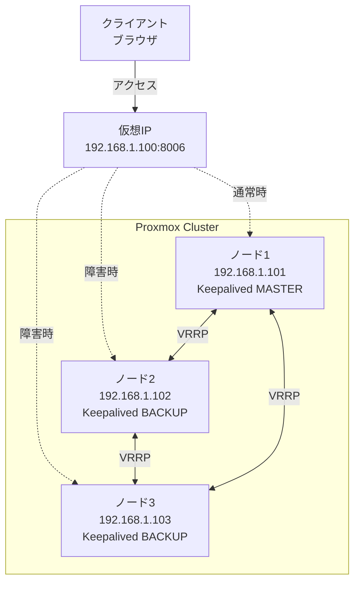

## はじめに

「Proxmox VEでクラスタ組んだのに、管理画面にアクセスできなくなった…」
そんな経験ありませんか?

Proxmox VEのクラスタ構成では、VM/CTのHigh Availability(以下、HAという)は実現できても、**管理画面(Web UI)自体の冗長化は標準機能では提供されていません**。ノードに障害が発生すると、そのノードの管理画面にはアクセスできなくなってしまいます。

この記事では、Keepalivedを使って**仮想 IP(VIP)で常に生きているノードの管理画面にアクセスできるようにする実践的な方法**を解説します。

## 前提条件

- Proxmox VEでをHAクラスタを構築済み、または構築予定の方
- 管理画面の冗長化を検討している方
- Linuxの基本的なコマンド操作ができる方

## 動作環境

- Proxmox VE
- 3ノード以上のクラスタ構成(2ノードでも可)
- ネットワークは同一セグメント内での構成

## なぜ管理画面の冗長化が必要なのか

### Proxmox VEクラスタの盲点

Proxmox VEのクラスタ機能は素晴らしいです。VMやCTのHA、ライブマイグレーション、集中管理など多くのメリットがあります。しかし、**管理画面へのアクセス方法については自分で考える必要があります**。

通常、以下のような運用になっていませんか？

```text
https://192.168.1.101:8006  # ノード1の管理画面
https://192.168.1.102:8006  # ノード2の管理画面
https://192.168.1.103:8006  # ノード3の管理画面
```

この状態だと：

- ノード1がダウンすると `192.168.1.101` にアクセスできない
- 毎回どのノードにアクセスするか考える必要がある
- ブックマークやスクリプトでIPを固定していると、障害時に困る

### Keepalivedによる解決

Keepalivedを使うと：

```text
https://192.168.1.100:8006  # 仮想IP(VIP)
```

常にこのVIPにアクセスするだけで、**生きているノードの管理画面に自動で接続**されます。

**仕組み：**

1. 各ノードでKeepalivedが動作
2. MASTERノードがVIPを保持
3. MASTERがダウンするとBACKUPノードがVIPを引き継ぐ
4. 数秒でフェイルオーバー完了

## 全体構成とゴール

### ネットワーク構成図



### 実現するゴール

- ✅ 単一のVIPで常に管理画面にアクセス可能
- ✅ ノード障害時に自動でフェイルオーバー
- ✅ 障害復旧後に自動で元の構成に戻る

## Keepalivedのインストール

### 全ノードでの作業

Proxmox VEはDebianベースなので、`apt`でインストールできます。

```bash
# パッケージリストの更新
apt update

# Keepalived のインストール
apt install keepalived -y

# バージョン確認
keepalived -v
```

**実行例：**

```bash
root@pve1:~# keepalived -v
Keepalived v2.2.7 (01/20,2023)
```

## Keepalivedの設定

### 設定の考え方

1. **virtual_router_id**：同じVRRPグループのノードは同じIDを使う(1〜255)
2. **priority**：値が大きいノードがMASTERになる
3. **state**：初期状態(MASTER or BACKUP)を指定

### MASTERノード(ノード1)の設定

`/etc/keepalived/keepalived.conf` を作成します。

```bash
nano /etc/keepalived/keepalived.conf
```

**設定内容：**

```conf
# グローバル設定
global_defs {
    enable_script_security  # スクリプト実行のセキュリティ機能を有効化
    script_user root        # スクリプトをroot権限で実行
    weight -20              # 失敗時に優先度を20下げる
}

# Proxmoxのpveproxyサービスを監視するヘルスチェックスクリプト
vrrp_script chk_proxmox {
    script "pidof pveproxy"  # pveproxyプロセスの存在確認
    interval 2               # 2秒ごとにチェック
}

# VRRPインスタンス定義
vrrp_instance VI_1 {
    state MASTER             # 初期状態をMASTERに設定(このノードを優先)
    interface vmbr0          # VIPを割り当てるネットワークインターフェース
    virtual_router_id 51     # VRRPグループID(全ノードで同じ値を設定)
    priority 100             # 優先度(最も高い値のノードがMASTERになる)
    advert_int 1             # VRRP広告の送信間隔(秒)
    
    # VRRP認証設定(セキュリティ向上のため)
    authentication {
        auth_type PASS       # パスワード認証を使用
        auth_pass password   # 共通パスワード(全ノードで同じ値を設定、8文字以内)
    }
    
    # 仮想IPアドレス(VIP)の設定
    virtual_ipaddress {
        192.168.100.10       # クライアントがアクセスする仮想IP
    }
    
    # ヘルスチェックスクリプトの適用
    track_script {
        chk_proxmox          # Proxmoxの監視を有効化
    }
    
    # 状態変化時のアクション
    notify_master ""   # MASTER昇格時にコマンド実行
    notify_backup ""    # BACKUP降格時にコマンド実行
    notify_fault ""     # 障害検知時にコマンド実行
}
```

### BACKUP ノード(ノード2)の設定

```bash
nano /etc/keepalived/keepalived.conf
```

**設定内容：**

```conf
# グローバル設定
global_defs {
    enable_script_security  # スクリプト実行のセキュリティ機能を有効化
    script_user root        # スクリプトをroot権限で実行
    weight -20              # 失敗時に優先度を20下げる
}

# Proxmoxのpveproxyサービスを監視するヘルスチェックスクリプト
vrrp_script chk_proxmox {
    script "pidof pveproxy"  # pveproxyプロセスの存在確認
    interval 2               # 2秒ごとにチェック
}

# VRRPインスタンス定義
vrrp_instance VI_1 {
    state BACKUP             # 初期状態をMASTERに設定(このノードを優先)
    interface vmbr0          # VIPを割り当てるネットワークインターフェース
    virtual_router_id 51     # VRRPグループID(全ノードで同じ値を設定)
    priority 90              # 優先度(最も高い値のノードがMASTERになる)
    advert_int 1             # VRRP広告の送信間隔(秒)
    
    # VRRP認証設定(セキュリティ向上のため)
    authentication {
        auth_type PASS       # パスワード認証を使用
        auth_pass password   # 共通パスワード(全ノードで同じ値を設定、8文字以内)
    }
    
    # 仮想IPアドレス(VIP)の設定
    virtual_ipaddress {
        192.168.100.10       # クライアントがアクセスする仮想IP
    }
    
    # ヘルスチェックスクリプトの適用
    track_script {
        chk_proxmox          # Proxmoxの監視を有効化
    }
    
    # 状態変化時のアクション
    notify_master ""    # MASTER昇格時にコマンド実行
    notify_backup ""    # BACKUP降格時にコマンド実行
    notify_fault ""     # 障害検知時にコマンド実行
}
```

### BACKUP ノード(ノード3)の設定

ノード2と同様ですが、さらに優先度を下げます。

```bash
nano /etc/keepalived/keepalived.conf
```

**設定内容：**

```conf
# グローバル設定
global_defs {
    enable_script_security  # スクリプト実行のセキュリティ機能を有効化
    script_user root        # スクリプトをroot権限で実行
    weight -20              # 失敗時に優先度を20下げる
}

# Proxmoxのpveproxyサービスを監視するヘルスチェックスクリプト
vrrp_script chk_proxmox {
    script "pidof pveproxy"  # pveproxyプロセスの存在確認
    interval 2               # 2秒ごとにチェック
}

# VRRPインスタンス定義
vrrp_instance VI_1 {
    state BACKUP             # 初期状態をMASTERに設定(このノードを優先)
    interface vmbr0          # VIPを割り当てるネットワークインターフェース
    virtual_router_id 51     # VRRPグループID(全ノードで同じ値を設定)
    priority 80              # 優先度(最も高い値のノードがMASTERになる)
    advert_int 1             # VRRP広告の送信間隔(秒)
    
    # VRRP認証設定(セキュリティ向上のため)
    authentication {
        auth_type PASS       # パスワード認証を使用
        auth_pass password   # 共通パスワード(全ノードで同じ値を設定、8文字以内)
    }
    
    # 仮想IPアドレス(VIP)の設定
    virtual_ipaddress {
        192.168.100.10       # クライアントがアクセスする仮想IP
    }
    
    # ヘルスチェックスクリプトの適用
    track_script {
        chk_proxmox          # Proxmoxの監視を有効化
    }
    
    # 状態変化時のアクション
    notify_master ""    # MASTER昇格時にコマンド実行
    notify_backup ""    # BACKUP降格時にコマンド実行
    notify_fault ""     # 障害検知時にコマンド実行
}
```

## サービスの起動と有効化

### 全ノードで実行

```bash
# 設定ファイルの文法チェック
keepalived -t

# サービスの起動
systemctl start keepalived

# 自動起動の有効化
systemctl enable keepalived

# 状態確認
systemctl status keepalived
```

:::message alert
起動に失敗する場合は、以下を確認してください：

- 設定ファイルの文法エラー(`keepalived -t`で確認)
- VIPが既に他のノードで使われていないか
- ファイアウォールでVRRP(プロトコル番号 112)が許可されているか

:::

## 動作確認

### 1. VIPの割り当て確認

**MASTERノード(pve1)で実行：**

```bash
ip addr show vmbr0
```

**期待される出力：**

```text
2: vmbr0: <BROADCAST,MULTICAST,UP,LOWER_UP> mtu 1500 qdisc noqueue state UP group default qlen 1000
    link/ether xx:xx:xx:xx:xx:xx brd ff:ff:ff:ff:ff:ff
    inet 192.168.1.101/24 brd 192.168.1.255 scope global vmbr0
       valid_lft forever preferred_lft forever
    inet 192.168.1.100/24 scope global secondary vmbr0  # ← VIPが追加されている
       valid_lft forever preferred_lft forever
```

`192.168.1.100`が**secondary**として追加されていれば成功です。

**BACKUPノード(pve2, pve3)で実行：**

VIPは割り当てられていないはずです。

### 2. Web UIへのアクセステスト

ブラウザでVIPにアクセスします。

```text
https://192.168.1.100:8006
```

Proxmoxの管理画面が表示されれば成功です！
ブラウザのタブに表示されているタイトルにpve1と表示されているはずです。

### 3. フェイルオーバーテスト

**MASTERノード(pve1)でKeepalivedを停止：**

```bash
systemctl stop keepalived
```

**即座にBACKUPノード(pve2)で確認：**

```bash
# VIPの割り当て確認
ip addr show vmbr0
```

pve2にVIPが移動し、MASTERに昇格したのが確認できるはずです。

**ブラウザで再度アクセス：**

```text
https://192.168.1.100:8006
```

引き続きアクセスできることを確認します。
ブラウザのタブに表示されているタイトルにpve2と表示されているはずです。

**MASTERノード(pve1)を復旧：**

```bash
systemctl start keepalived
```

`priority 100` が最高値のため、pve1が再びMASTERに昇格します。
ブラウザのタブに表示されているタイトルにpve1と表示されているはずです。

## まとめ

Keepalivedを使ったProxmox VE管理画面の冗長化について解説しました。

### 実装のポイント

#### ✅ 単一の VIP で常にアクセス可能

ブックマークやスクリプトを変更不要に

#### ✅ 自動フェイルオーバー

ノード障害時に3〜5秒で切り替わる

#### ✅ 運用の簡素化

「どのノードにアクセスするか」を考える必要がなくなる
