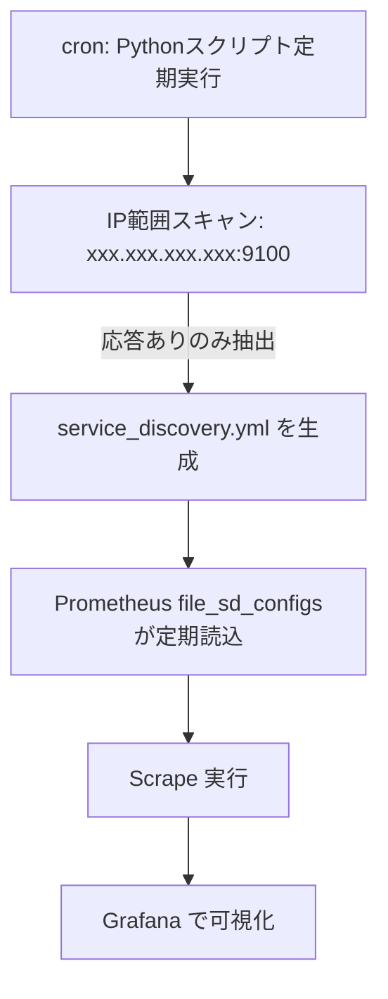

## はじめに

サーバ台数が増減するたびに、Prometheusの`prometheus.yml`の`targets`を手動で編集していませんか？
10台、20台、30台…と増えるほど、更新漏れや工数が雪だるま式に膨らみます。
本記事では、Pythonでネットワークをスキャンして稼働中の`node_exporter`を検索し、PrometheusのServiceDiscoveryにIPアドレス一覧を渡す仕組みを作ります。

## 前提条件

- Prometheusが構築済み
- node_exporterがインストール済み
- Python3.x系がインストール済み
- Python仮想環境を構築済み

## 全体像

- ゴール: 稼働中のnode_exporterを取得して監視対象を自動増減
- 方式: Prometheusのfile_sd_configs + Pythonスクリプト + 定期実行



## 手順と実装

### 1. Prometheusの設定

- `prometheus.yml`の`scrape_configs`に`file_sd_configs`を追加
- `refresh_interval`でファイルの再読込間隔を設定（省略時はデフォルト）

#### 1.1. prometheus.ymlを開く

```bash
nano /etc/prometheus/prometheus.yml
```

:::message
`prometheus.yml`のファイルパスはご自身の環境に合わせて変えてください。
:::

#### 1.2. file_sd_configsの設定を追記

```yaml
global:
  scrape_interval: 15s
  evaluation_interval: 15s

scrape_configs:
  - job_name: "prometheus"
    static_configs:
      - targets: ["localhost:9090"]
        labels:
          app: "prometheus"
  ###### 以下を追記 ######
  - job_name: "nodes"
    file_sd_configs:
      - files:
        - /etc/prometheus/service_discovery.yml
        refresh_interval: 15s
```

:::message
`file_sd_configs`に設定するファイルは**YAML**または**JSON**のどちらかです。
:::

:::message
`service_discovery.yml`のファイルパスはご自身の環境に合わせて変えてください。
:::

### 2. Pythonスクリプトでservice_discovery.ymlを生成

- 対象範囲のIPアドレスの9100番ポートに対してリクエストして応答確認
- `aiohttp`と`asyncio`で非同期高速処理
- 応答したIPアドレスを`service_discovery.yml`に出力

#### 2.1. service_discovery.ymlを開く

```bash
nano /etc/prometheus/service_discovery.yml
```

:::message
`service_discovery.yml`のファイルパスはご自身の環境に合わせて変えてください。
:::

#### 2.2. IP自動取得スクリプトを実装

```bash
pip install PyYAML
pip install aiohttp
```

```bash
nano auto-scan-node-exporter.py
```

```python
import yaml
import asyncio
import aiohttp

# --- 設定 ---
SERVICE_DISCOVERY_FILE_PATH = '/etc/prometheus/service_discovery.yml'
NODE_EXPORTER_PORT = 9100

async def check_ip(session, ip):
  """
  指定されたIPのエンドポイントの応答をチェックする。
  """
  url = f"http://{ip}/"
  try:
    async with session.get(url, timeout=0.3) as response:
      if response.status == 200:
        print(f'\033[92m✓ 応答あり: {ip}\033[0m')
        return True
      print(f'\033[91m✗ 応答なし: {ip}\033[0m')
      return False
  except Exception:
    print(f'\033[91m✗ アクセス失敗: {ip}\033[0m')
    return False

def generate_ip_range():
  """
  10.0.1.1から10.0.9.99までのIP範囲を生成する。
  """
  targets = []
  for subnet in range(1, 10):  # 1 to 9
    ips = []
    for host in range(1, 100):
      ips.append(f'10.0.{subnet}.{host}:{NODE_EXPORTER_PORT}')
    if ips:
      targets.append(ips)
  return targets

async def filter_responding_targets(targets):
  """
  Node Exporterのエンドポイントにアクセスして応答のあるターゲットのみを返す。
  """
  responding = []
  async with aiohttp.ClientSession() as session:
    for ips in targets:
      tasks = [check_ip(session, ip) for ip in ips]
      results = await asyncio.gather(*tasks)
      responding_ips = []
      for ip, ok in zip(ips, results):
        if ok:
          responding_ips.append(ip)
      if responding_ips:
        responding.append(responding_ips)
  return responding

def generate_prometheus_config(targets):
  """
  取得したターゲットリストをPrometheusのファイルベースのService Discovery形式で出力する。
  """
  prometheus_targets = []
  for ips in targets:
    prometheus_targets.append({'targets': ips})
  with open(SERVICE_DISCOVERY_FILE_PATH, 'w') as f:
    yaml.dump(prometheus_targets, f, default_flow_style=False, sort_keys=False)
  print("-" * 50)
  print(f'ファイル "{SERVICE_DISCOVERY_FILE_PATH}" を生成しました。')
  print('生成されたターゲットリスト:')
  for ips in targets:
    for ip in ips:
      print(f'- {ip}')

async def main():
  targets = generate_ip_range()
  print("\033[94m🔍 Node Exporterの応答を確認中...\033[0m")
  targets = await filter_responding_targets(targets)
  generate_prometheus_config(targets)

if __name__ == '__main__':
  asyncio.run(main())
```

:::message
`auto-scan-node-exporter.py`のファイルパスはご自身の環境に合わせて変えてください。
:::

### 3. crontabで定期実行設定

- crontabでPythonスクリプトを定期実行するように設定
- cron.logにログを出力

#### 3.1. crontabを開く

```bash
crontab -e
```

#### 3.2. Pythonスクリプトの定期実行を設定

```bash
* * * * * /home/ubuntu/workspace/python_venv/bin/python /home/ubuntu/workspace/auto-scan-node-exporter.py > /home/ubuntu/workspace/cron.log 2>&1
```

### 4. Prometheusを再起動

```bash
sudo systemctl restart prometheus.service
```

:::message
`systemd`以外を使っている人はご自身の環境に合わせてPrometheusを再起動してください。
:::

## まとめ

- ServiceDiscoveryにより、Prometheus本体の再起動や手動編集無しで監視対象を増減できます。
- Pythonの非同期スキャンで、数百ホスト規模でも短時間で検出できます。
- まずは小さなサブネットから導入し、IP範囲やスキャン間隔、書き出し先を自身の環境に合わせて調整するのがおすすめです。

## 参考リンク

- [Prometheus Docs](https://prometheus.io/docs/prometheus/latest/configuration/configuration/)
