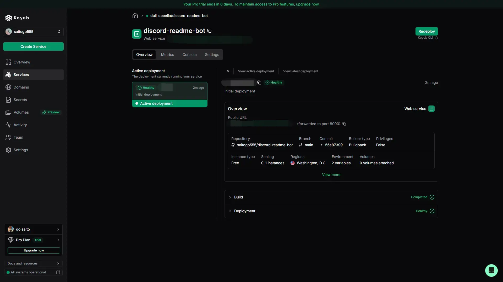

## この章のゴール

この章では、Viteを使ってReactプロジェクトを素早くセットアップする方法を学びます。Viteは高速な開発環境を提供し、初心者からプロまで幅広く利用されています。ここでは、ViteのインストールからReactプロジェクトの作成、開発サーバーの起動までの手順を、画像付きでわかりやすく解説します。

---

## Viteとは？

Vite（ヴィート）は、次世代のフロントエンドツールで、従来のビルドツールよりも**高速な開発体験**を提供します。主な特徴は以下の通りです。

- 超高速な開発サーバー起動
- モダンなESモジュール対応
- シンプルな設定

Reactプロジェクトの立ち上げにも最適です。

---

## 必要なもの

ViteでReactプロジェクトを始めるには、以下が必要です。

- Node.js（推奨バージョン: 16以上）
- npm または yarn

Node.jsがインストールされていない場合は、[公式サイト](https://nodejs.org/)からダウンロードしてください。

---

## プロジェクトの作成手順

### 1. プロジェクト用ディレクトリの作成

まず、作業用のディレクトリを作成します。

```zsh
mkdir my-react-app
cd my-react-app
```

### 2. ViteでReactプロジェクトを作成

Viteの公式テンプレートを使ってReactプロジェクトを作成します。

```zsh
npm create vite@latest . -- --template react
```

実行後、プロジェクト名やフレームワークの選択肢が表示される場合は、`react`を選択してください。

> 

### 3. 依存パッケージのインストール

プロジェクトディレクトリ内で依存パッケージをインストールします。

```zsh
npm install
```

> 

### 4. 開発サーバーの起動

開発サーバーを起動し、Reactアプリをブラウザで確認します。

```zsh
npm run dev
```

コマンド実行後、ターミナルに表示されるローカルURL（例: http://localhost:5173）にアクセスしてください。

> 

---

## よくあるエラーと対処法

- **Node.jsのバージョンが古い**: 最新のLTSバージョンをインストールしてください。
- **ポートがすでに使用されている**: 別のアプリが同じポートを使っていないか確認し、必要に応じてプロセスを停止してください。

---

お疲れさまでした！これでReactの開発準備は整ったので、あとはコーディングしていくだけです。

次以降のステップでは、Reactの主な機能の解説と練習問題をやっていきます。。